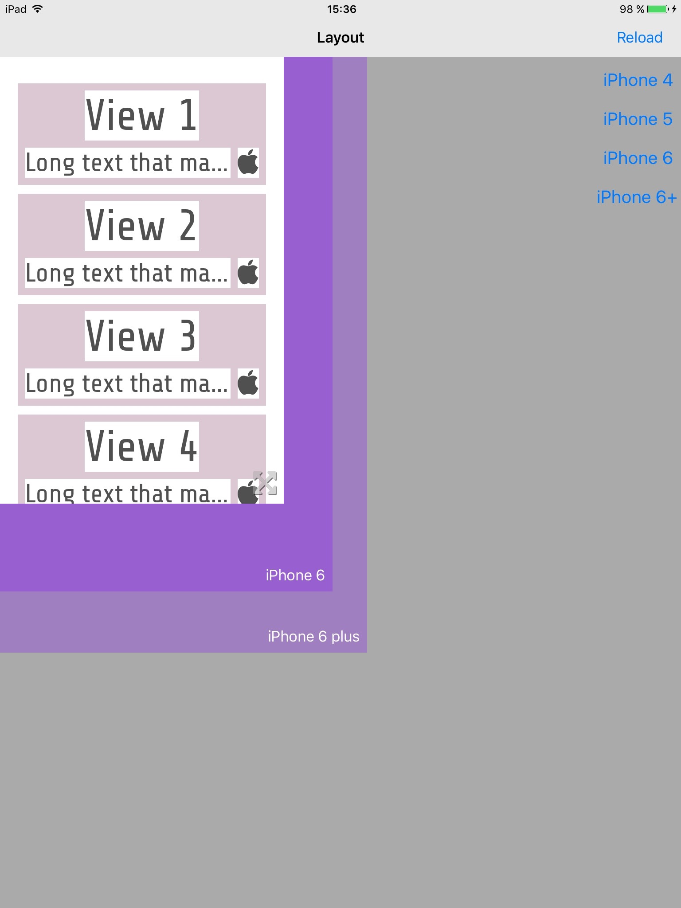

# LayoutHelperApp

With this app you can code and quickly debug your layouts before adding them to your app.

The app is meant to be run on an iPad so you can preview the layout in different sizes with the resizable container view.

Edit [PreviewController.swift](LayoutHelperApp/PreviewController.swift) and configure your layout there.

You may use util classes like [LayoutBuilder](LayoutHelperApp/LayoutBuilder.swift) and [LinearBuilder](LayoutHelperApp/LinearBuilder.swift).

If just run the app you will see an example, that looks similar to this:

