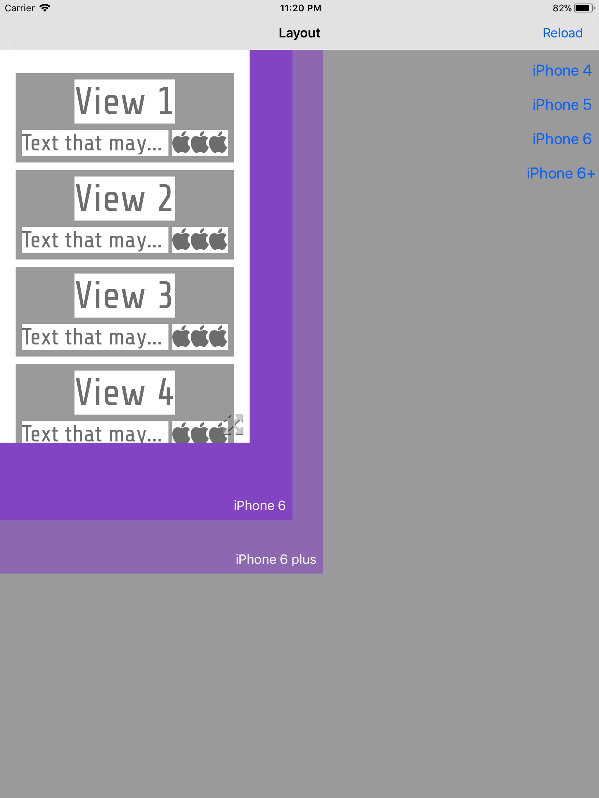

# LayoutHelperApp

With this app you can code and quickly debug your layouts before adding them to your app.

The app is meant to be run on an iPad so you can preview the layout in different sizes with the resizable container view.

Edit [PreviewController.swift](LayoutHelperApp/Controllers/PreviewController.swift) and configure your layout there.

You may use util classes like [LayoutBuilder](LayoutHelperApp/Util/LayoutBuilder.swift) and [LinearBuilder](LayoutHelperApp/Util/LinearBuilder.swift).

Those classes let you build layouts using the [Visual Format Language](https://developer.apple.com/library/content/documentation/UserExperience/Conceptual/AutolayoutPG/VisualFormatLanguage.html)
with extra features to make it much easier. Example:

```swift
        let row = LinearBuilder(axis: .horizontal) // similar to Android's LinearLayout
            .margin(between: 5)
            .addViews([subtitle, icon])
            .wrapContent(view: icon) // similar to Android's wrap_content
            .getView()

        let view = LayoutBuilder()
            .addViews(["title":title, "row":row])
            .addConstraints([
                "V:|-[title]-[row]-|",
                "H:|-[row]-|",
                "X:title.centerX == parent.centerX"  // extra constraint format, supported by LayoutBuilder
            ])
            .view
```  

You can see the complete code in [PreviewController.swift](LayoutHelperApp/Controllers/PreviewController.swift).

If run the app you will see something like this:



